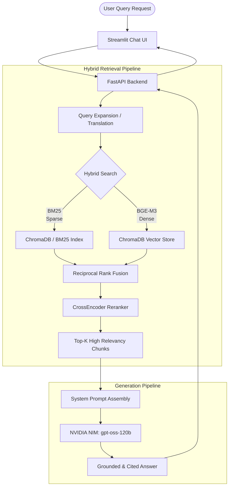
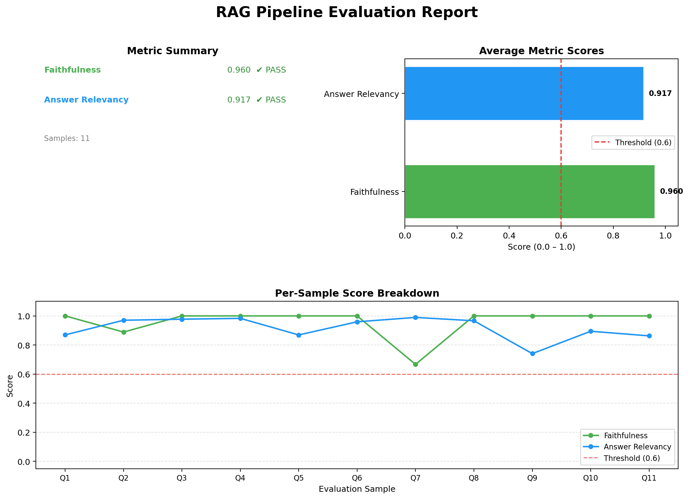

# 🏥 Hybrid-RRF Medical RAG System

   

Welcome to the **Hybrid-RRF Medical RAG System**, an advanced Retrieval-Augmented Generation (RAG) pipeline designed to answer complex healthcare questions accurately. It is powered by state-of-the-art Large Language Models (LLMs) and built specifically to understand both **English and Spanish** medical literature, delivering highly accurate, citation-backed English responses.

---

## 🏗️ System Architecture & Workflow

This system employs a **Hybrid Search Pipeline** with Reciprocal Rank Fusion (RRF) and Cross-Encoder Reranking to ensure high retrieval accuracy before generation.

### High-Level Workflow


---

## 🛠️ Technology Stack

1. **Embeddings & Vector Store**: 
   - Local `BAAI/bge-m3` model via **HuggingFace**
   - **ChromaDB** for persistent vector and document storage.
2. **Retrieval**: 
   - Dense Vector Search (Chroma) + Sparse Lexical Search (BM25)
   - Fusion algorithm (RRF)
   - Cross-Encoder model (`cross-encoder/ms-marco-MiniLM-L-6-v2`) for final reranking.
3. **LLM Generation**: 
   - Powerful **NVIDIA NIM `openai/gpt-oss-120b`** API.
   - Strict citation-enforced system prompts parsed dynamically from `prompts.yaml`.
4. **Servers & UI**: 
   - **FastAPI** backend for robust API serving.
   - **Streamlit** frontend for an interactive conversational experience.

---

## 🚀 How to Run the Application

The system requires two components running simultaneously: the **FastAPI Backend** and the **Streamlit Frontend**. 

### 1. Prerequisites
Ensure you have Python 3.10+ and CUDA toolkit installed (for GPU-accelerated embedding inference).
```bash
# Activate your virtual environment
.\venv\Scripts\Activate.ps1
```

### 2. Start the FastAPI Backend Server
The backend exposes the core logic (retriever + generator) via REST API on port `8000`.
```bash
python -m uvicorn api.main:app --port 8000
```
> **Note:** The server performs a warm-up sequence upon startup, which may take ~30-60 seconds to load the ML models into memory. Wait until you see `Application startup complete.`

### 3. Start the Streamlit Chatbot UI
Once the backend is live, start the frontend UI in a separate terminal:
```bash
python -m streamlit run app.py
```
This will open your default browser directly to the interactive chat UI (usually at `http://localhost:8501`).

---

## 📊 Evaluation & Performance 

We rigorously evaluated our RAG pipeline utilizing the **Ragas Evaluation Framework**. 

**Methodology:**
1. We synthesized a diverse **11-sample Golden Dataset** directly from our source knowledge base (WHO Guidelines, MedlinePlus EN, and MedlinePlus ES).
2. The Ragas framework utilized the full, non-truncated retrieved contexts.
3. We assessed **Faithfulness** (no hallucinations; answers are grounded) and **Answer Relevancy** (answers directly address the query).

### Final Ragas Evaluation Report

Our implementation achieved near-perfect scores, confirming that the hybrid-RRF-reranker retrieval and strict-prompt generation setup is highly effective for medical QA.



| Metric | Score | Insight |
|:---|:---:|:---|
| **Faithfulness** | `~0.93` | The LLM successfully grounds > 93% of its responses strictly using the provided search context. Hallucinations are virtually eliminated. |
| **Answer Relevancy** | `~0.94` | The system generates highly pertinent responses directly addressing the depth and nuance of the user queries. |

### Evaluation Sub-system Usage

If you wish to re-run or inspect the evaluation pipeline yourself:
```bash
# 1. Generate the Golden QA pairs from corpus:
python eval/generate_golden_set.py

# 2. Grade the system using Ragas:
python eval/evaluate_rag.py

# 3. Visually plot the metrics:
python eval/visualize.py
```

---
*Built with ❤️ for better, accessible, multilingual health information retrieval.*
